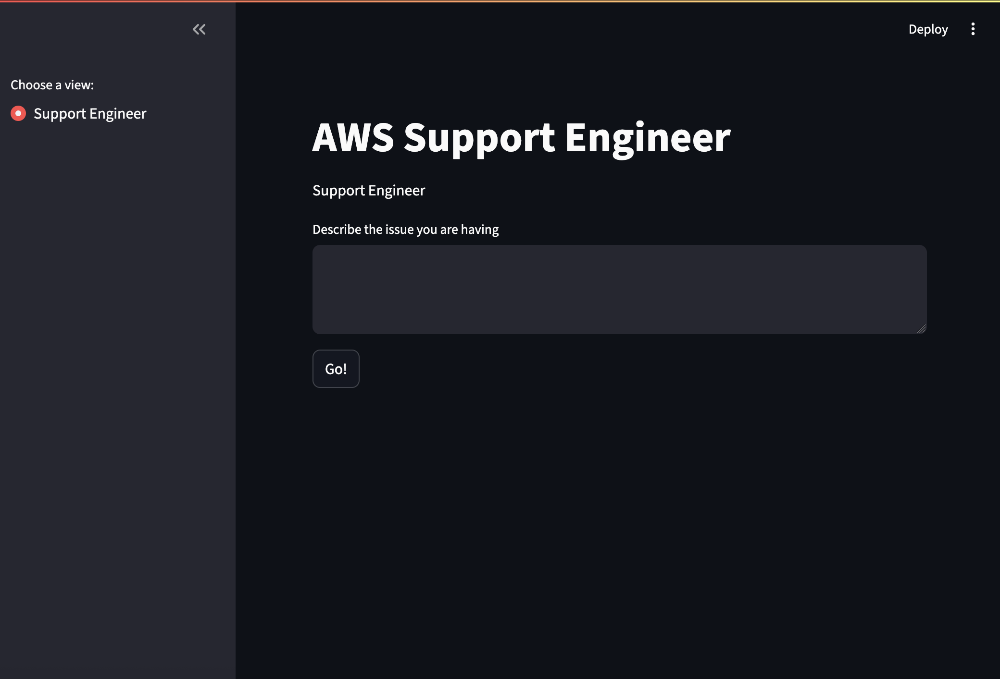

# Agentic AI Support Engineer (Streamlit App)

This project is a lightweight **Streamlit-based UI** for interacting with an **Agentic AI support engineer**. It leverages **AWS Bedrock via the AWS Strands SDK** to power a context-aware assistant capable of answering technical queries based on structured workflows.

## 🧠 Overview

The app acts as a frontend for an "agent" that:
- Uses **MCP (Model Context Protocol)** to structure tasks and responses
- Supports **streamed output** for real-time interaction
- Is tailored for **AWS infrastructure and support scenarios**

## 📁 Project Structure

```
.
├── main.py               # Streamlit app entrypoint
├── support_engineer.py   # Agent setup logic using AWS Strands
```

## 🚀 Getting Started

### 1. Clone the Repository

```bash
git clone https://github.com/your-org/agentic-ai-support.git
cd agentic-ai-support
```

### 2. Set Up Environment with `uv`

```bash
uv venv
source .venv/bin/activate  # or .venv\Scripts\activate on Windows
uv pip install -r requirements.txt
```

> If you don’t have `uv` installed, you can get it via:
>
> ```bash
> curl -LsSf https://astral.sh/uv/install.sh | sh
> ```

### 3. Set Required Environment Variables

```bash
export AWS_PROFILE=your-profile-name
export AWS_REGION=your-region
```

### 4. Run the App

```bash
streamlit run main.py
```

## 💡 How It Works

- `support_engineer.py`: Defines the Bedrock agent and its configuration, using a "support engineer" persona. It sets the task and model to be used.
- `main.py`: Provides the user interface via Streamlit, capturing input and streaming responses back from the agent in real-time.

## 🔐 Requirements

- AWS credentials with permission to invoke Bedrock models
- Access to a Bedrock model like `anthropic.claude-3-sonnet` (or similar)
- MCP-compatible agent configuration

## 🛠️ Customization

To tailor the agent:
- Modify the persona, task, or workflow in `support_engineer.py`
- Adjust the UI or behavior in `main.py` to fit your domain-specific needs

## 📸 Example UI



## 🧾 License

MIT or internal-use only — customize as per your project needs.